# WattVision AI — System Architecture & Design Specification

## 1. Architectural Overview

**WattVision AI** is a microservices-based platform designed for **Electricity Wastage Detection using Machine Learning**. The system operates on digital telemetry streams (simulated, CSV uploads, or batch API feeds) without requiring physical IoT or smart metering hardware.

```mermaid
flowchart TB
    subgraph ClientLayer["Frontend Client (React 19 + Vite)"]
        UI[Single Page Application]
        Charts[Recharts Visualizations]
        Simulator[Digital Telemetry Simulator]
        AuthCtx[Auth & Session Context]
    end

    subgraph GatewayLayer["Reverse Proxy & Gateway"]
        Nginx[Nginx Web Server]
    end

    subgraph BackendLayer["Core Backend (Spring Boot 3.3 / Java 17)"]
        Sec[Spring Security + JWT Auth]
        Controllers[REST Controllers]
        Services[Domain & Business Logic]
        Scheduler[Reprocessing Scheduled Task]
        MLClient[ML Inference Client]
    end

    subgraph DatabaseLayer["Persistence Layer (MySQL 8.4)"]
        Flyway[Flyway Migrations]
        MySQL[(wattvision_db)]
    end

    subgraph MLLayer["ML Microservice (FastAPI + Python 3.12)"]
        FastAPI[FastAPI API Engine]
        IForest[Isolation Forest Model]
        FeatEng[Feature Engineering Pipeline]
        XAI[Explainable AI Rules Engine]
        Metrics[Prometheus Exporter]
    end

    UI --> Nginx
    Nginx -- "/api/*" --> Controllers
    Nginx -- "/*" --> UI
    Controllers --> Sec
    Sec --> Services
    Services --> MySQL
    Services --> MLClient
    Scheduler --> MLClient
    MLClient -- "POST /predict" --> FastAPI
    FastAPI --> FeatEng
    FeatEng --> IForest
    IForest --> XAI
    XAI --> FastAPI
```

---

## 2. Microservice Breakdown

### 2.1 Frontend Client (`/frontend`)
- **Technology Stack**: React 19, Vite, Tailwind CSS, Recharts, Lucide Icons, Vitest, Testing Library.
- **Key Responsibilities**:
  - Interactive dashboards with hourly, daily, and monthly consumption breakdowns.
  - Anomaly investigation console with explainable root-cause diagnosis.
  - Interactive digital telemetry simulator with anomaly injection scenarios (AC spike, geyser overrun, idle leak).
  - Configurable dual-mode operation: `VITE_DEMO_MODE=true` for offline presentation and `false` for live REST API connectivity.

### 2.2 Core Backend Microservice (`/backend`)
- **Technology Stack**: Spring Boot 3.3.3, Java 17, Spring Data JPA, Spring Security with stateless JWT, Flyway 10, OpenAPI / Swagger UI.
- **Key Responsibilities**:
  - Ingestion endpoints: single reading (`POST /api/consumption/records`), batch stream (`POST /api/consumption/batch`), and CSV import (`POST /api/consumption/upload-csv`).
  - Automated anomaly classification, severity routing (LOW, MEDIUM, HIGH, CRITICAL), and alert generation.
  - Appliance load breakdown and energy efficiency budgeting.
  - Graceful degradation: in case of ML inference timeout or temporary service restart, consumption is safely persisted and queued for background scoring via `@Scheduled` background worker.

### 2.3 Machine Learning Microservice (`/ml-service`)
- **Technology Stack**: Python 3.12, FastAPI, scikit-learn 1.5, pandas, NumPy, Prometheus client.
- **Key Responsibilities**:
  - Feature extraction across 9 temporal and load features:
    1. `kwh`: Instantaneous electricity reading.
    2. `hour_of_day`: Circular time component.
    3. `day_of_week`: Weekly consumption cycle.
    4. `is_weekend`: Weekend vs. weekday baseline distinction.
    5. `expected_baseline_kwh`: Expected consumption baseline for the time slot.
    6. `excess_kwh`: Direct difference between actual consumption and baseline.
    7. `deviation_ratio`: Proportional deviation factor.
    8. `rolling_avg_3h`: 3-hour moving average.
    9. `rolling_std_3h`: 3-hour moving standard deviation.
  - Unsupervised outlier scoring via scikit-learn's `IsolationForest` algorithm.
  - Explainable AI (XAI) rule generation to output human-readable root causes and targeted remediation recommendations.

---

## 3. Database Schema Design (Flyway `V1__init_schema.sql`)

| Table Name | Description | Key Indexes |
| :--- | :--- | :--- |
| `users` | User accounts, credentials, roles (`ROLE_USER`, `ROLE_ADMIN`), and monthly energy goals. | `email` (unique) |
| `consumption_records` | Timestamped digital consumption readings with baseline and ML scoring metadata. | `(user_id, timestamp)`, `(processed, timestamp)` |
| `wastage_events` | Machine learning flagged anomalies with severity, confidence, root cause, and resolution status. | `(user_id, timestamp)`, `status`, `severity` |
| `appliance_profiles` | User-configured appliance wattage specifications and operating schedule profiles. | `user_id` |
| `alerts` | Notification alerts dispatched to users on critical or elevated anomaly detection. | `(user_id, read_status)` |
| `audit_logs` | Security and administrative audit trail logging model calibrations, retrains, and user modifications. | `timestamp`, `user_id` |
| `reports` | Periodic energy audit summaries and downloadable CSV reports. | `(user_id, generated_at)` |

---

## 4. Security & Fault-Tolerance Principles

1. **Stateless JWT Authentication**: Secure HMAC-SHA256 tokens passed via `Authorization: Bearer <token>` headers.
2. **Role-Based Access Control (RBAC)**: All administrative endpoints (`/api/admin/**`) protected with `@PreAuthorize("hasRole('ADMIN')")`.
3. **Internal Microservice Token**: Backend-to-ML HTTP calls authenticated via `X-API-Key` headers.
4. **Resilient HTTP Bridge**: Configured with 3-second connection timeouts, 10-second read timeouts, and non-blocking retry mechanisms.
